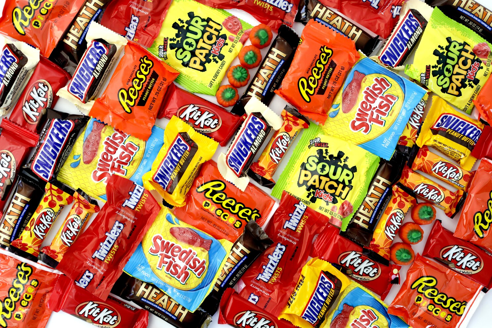

# Data Visualization - Self-Paced Work
Follow these instructions to practice your data visualization skills! You are also welcome to explore more on your own, and see what you can create. We recommend continuing in a Google Sheet or a Google Colab notebook. Explore one of the datasets below!

>Note: If desired, you can also feel free to check out the "Additional Explorations" at the bottom of the [homepage](StudentDesc.md).

## Candy Power Rankings
This dataset compares different types of candy to each other.

### Resources
- [Google Sheet](https://docs.google.com/spreadsheets/d/1fBZ5RpkGduRXFAW4pgFY0MqglLmtS1vEMT9SFbLujT4/edit?usp=sharing)
- [Colab Notebook](https://colab.research.google.com/drive/16fs6yWZd_CsjM8vZgqkrk1l4ysNdsNDk?usp=sharing)

### Data Dictionary
- `chocolate`: Does it contain chocolate?
- `fruity`: Is it fruit flavored?
- `caramel`: Is there caramel in the candy?
- `peanutalmondy`: Does it contain peanuts, peanut butter or almonds?
- `nougat`: Does it contain nougat?
- `crispedricewafer`: Does it contain crisped rice, wafers, or a cookie component?
- `hard`: Is it a hard candy?
- `bar`: Is it a candy bar?
- `pluribus`: Is it one of many candies in a bag or box?
- `sugarpercent`: The percentile of sugar it falls under within the data set.
- `pricepercent`: The unit price percentile compared to the rest of the set.
- `winpercent`: The overall win percentage according to 269,000 matchups.

### Sources
- [FiveThirtyEight Article](https://fivethirtyeight.com/videos/the-ultimate-halloween-candy-power-ranking/)
- [Kaggle Page](https://www.kaggle.com/datasets/fivethirtyeight/the-ultimate-halloween-candy-power-ranking)
- [CSV Data](https://github.com/hytechcamps/data-viz/blob/master/Datasets/candy.csv)

## Video Game Systems
This dataset has average IGN Review scores by platform and genre.

### Resources
- [Google Sheet](https://docs.google.com/spreadsheets/d/1_g-C9wXBuzbC0MTUT518OYY7UsH6P8o7fM-7tXPaIDU/edit?usp=sharing)
- [Colab Notebook](https://colab.research.google.com/drive/16LzE7Wron-y-Sr8HV8RsKKJCgwPGVHX7?usp=sharing)

### Data Dictionary
- `Platform`: The video game console for the games
- Genre (`Adventure`, `Puzzle`, `Racing`, etc): The genre for the games

For example, on the **Nintendo DS** row, the **Fighting** column has a value of `6.32`. This means that of all the fighting games for the Nintendo DS, the average IGN rating (out of 10) is 6.32!

### Sources
- [Kaggle Walkthrough](https://www.kaggle.com/code/gauravduttakiit/exercise-bar-charts-and-heatmaps/notebook)
- [CSV Data](https://github.com/hytechcamps/data-viz/blob/master/Datasets/ign_scores.csv)

## NBA Game Data
This dataset contains records for NBA games from 1946-2015. It includes a lot of [Elo rating](https://en.wikipedia.org/wiki/Elo_rating_system) data.

### Resources
- [Google Sheet](https://docs.google.com/spreadsheets/d/1IjbIMWXAU89MbFRWkxIuh0Sqzuku_anGpWWB5zdhQfI/edit?usp=sharing)
- [Colab Notebook](https://colab.research.google.com/drive/1O737-IGawd_r8DL_saakZbZf6hC2VI3U?usp=sharing)

### Data Dictionary
- `gameorder`: Play order of game in NBA history
- `game_id`: Unique ID for each game
- `lg_id`: Which league the game was played in
- `_iscopy`: Each row of data is tied to a single team for a single game, so `_iscopy` flags if this game_id has already occurred for the opposing team in the same matchup
- `year_id`: Season id, named based on year in which the season ended
- `date_game`: Game date
- `is_playoffs`: Flag for playoff games
- `team_id`: Three letter code for team name, from Basketball Reference
- `fran_id`: Franchise id. Multiple `team_id`s can fall under the same `fran_id` due to name changes or moves. Interactive is grouped by `fran_id`.
- `pts`: Points scored by team
- `elo_i`: Team elo entering the game
- `elo_n`: Team elo following the game
- `win_equiv`: Equivalent number of wins in a 82-game season for a team of `elo_n` quality
- `opp_id`: Team id of opponent
- `opp_fran`: Franchise id of opponent
- `opp_pts`: Points scored by opponent
- `opp_elo_i`: Opponent elo entering the game
- `opp_elo_n`: Opponent elo following the game
- `game_location`: Home (H), away (A), or neutral (N)
- `game_result`: Win or loss for team in the `team_id` column
- `forecast`: Elo-based chances of winning for the team in the `team_id` column, based on elo ratings and game location
- `notes`: Additional information

### Sources
- [Kaggle Page](https://www.kaggle.com/datasets/fivethirtyeight/fivethirtyeight-nba-elo-dataset)
- [CSV Data](https://github.com/hytechcamps/data-viz/blob/master/Datasets/nba.csv)

## NFL Players Data
This dataset contains information about current NFL players.

### Resources
- [Google Sheet](https://docs.google.com/spreadsheets/d/1_2gxbeokq0TPxm3UI6eL1lvZ03CL7pHmW4ZxNQ226xc/edit?usp=sharing)
- [Colab Notebook](https://colab.research.google.com/drive/1Uy6ebo-V9WxxXwTBdVR-2zhbeOaXu1FW?usp=sharing)

### Data Dictionary
- `nflId`: Player identification number, unique across players (numeric)
- `height`: Player height (numeric)
- `weight`: Player weight (numeric)
- `birthDate`: Date of birth (M/D/YYYY)
- `collegeName`: Player college (text)
- `position`: Player position (text)
- `displayName`: Player name (text)

### Sources
- [Kaggle Page](https://www.kaggle.com/datasets/aryashah2k/beginners-sports-analytics-nfl-dataset?select=players.csv)
- [CSV Data](https://github.com/hytechcamps/data-viz/blob/master/Datasets/nfl_players.csv)

## Titanic Passenger Data
This dataset contains information about passengers on the Titanic.

### Resources
- [Google Sheet](https://docs.google.com/spreadsheets/d/1TcYozHHXhVE1esummV95vAYXKxkXbsoQLyf31TUBlO0/edit?usp=sharing)
- [Colab Notebook](https://colab.research.google.com/drive/1z8Ojk-woqhhMQXs49DPpHKcRqAKovEuI?usp=sharing)

### Data Dictionary
- `Survived`: Whether the passenger survived or not
- `Pclass`: Passenger ticket class (first, second, or third)
- `Name`: Passenger's name
- `Sex`: Passenger's sex
- `Age`: Passenger's age
- `Siblings/Spouses Aboard`: Number of siblings/spouses also aboard the Titanic
- `Parents/Children Aboard`: Number of parents/children also aboard the Titanic
- `Fare`: Amount paid for ticket (in pounds)

### Sources
- [Stanford CS109 Problem](https://web.stanford.edu/class/archive/cs/cs109/cs109.1166/problem12.html)
- [CSV Data](https://github.com/hytechcamps/data-viz/blob/master/Datasets/titanic.csv)